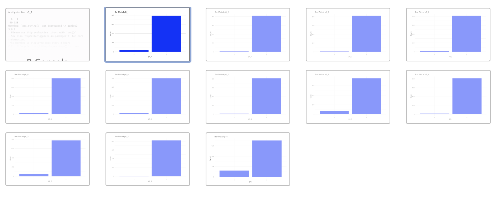
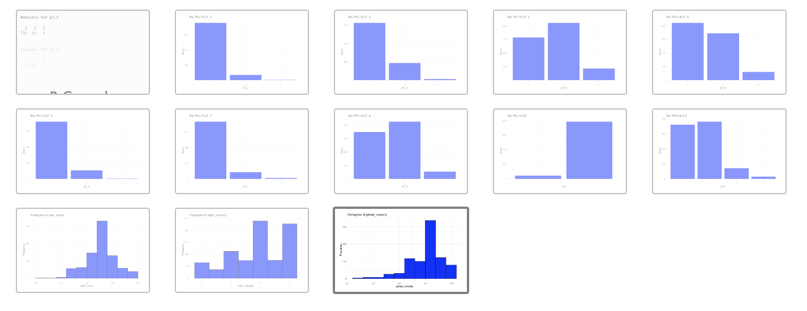

# Soluciones

1.  **Imputación NA**. Bien hecho.

2.  **Unsupervised y supervised machine learning**. PCA sirve como tipo
    de clustering para recalcular y agrupar ordenando

3.  Para PCA. tipo de categoría mayor que 5 o 6. optimal scaling, etc.
    <https://stats.stackexchange.com/questions/215404/is-there-factor-analysis-or-pca-for-ordinal-or-binary-data/215483#215483>

    categorical PCA: rank PCA, princals (paquete hifi). factominer es el
    paquete más usado de PCA

    índice numérico. indice correle con datos objetivos policiales o lo
    que sea pero tengo que decidir los pesos q le doy a la variable
    (maneras de pesar esto de forma más objetiva x ej mirando el código
    penal y ver el número de años q caen para cada delito), lo
    multiplico y lo sumo todo, el valor absoluto no es del todo
    interpretable. cuando crece crece etc. loimportante es que el índice
    sea monotónico.

    trabajar con los números relativos de los delitos en lugar de los
    absolutos.

4.  imbalance. puede que no sea un problema. corregir el desbalanceo a
    veces es malo.

5.  mirar en openstreets maps pamplona. hay paquetes para R, OSM data,
    probar qué info tienen de pamplona. si nno sacar de openstreet maps
    los puntos de interés y en función del punto de interés en un radio
    x y si sale x% q es comercios, es una zona comercial. es más
    trabajo. Landuse:
    <https://wiki.openstreetmap.org/wiki/Tag:landuse=commercial>

    una manera sencilla de sacar indice de iluminación es a imagen de
    satélite de noche y valor del pixel. conseguir un raster (imagen con
    coordenadas q es puro pixel y cada pixel está geolocalizado y si
    consigo imagen de pamplona de noche sin nubes tengo el nivel de
    iluminación por cada píxel). si lo incorporo a una variable por
    barrio y lo que se puede hacer es una media con todos los píxeles
    por barrio para sacar cómo de iluminado está. para dejar la media
    bien pulida: perimetro del barrio. dentro hay edificios, q los da
    open street map, habria que quitarle los edificios, se proyecta en
    el ruster y se hace la media de esos pixeles, es decir sin los
    edificios.

6.  quito del indice de percepcion las camaras

7.  comisaría: un circulo al rededor y cuanto más te alejas más
    inseguridad y más probable q ocurra un delito. cogerlo con pinzas
    por el tema de aglomeraciones etc. mejor descartamos esto.

8.  la percepcion va definida dentro de los agentes. con las
    sociodemográficas. el criminal no sabe lo que percibes pero una
    actua de una manera más o menos cauta y te hace más o menos
    susceptible a q te pase algo. las variables de autoproteccion van
    por fuera en el modelo y si son significativas las meto en gama en
    la definición de los agentes. da una probabilidad de que suceda un
    evento (sentirse más o menos inseguro), los parámetros no tienen por
    qué ser o no correctos luego cada cual los puede modificar. el motor
    del simulador va tirando probabilidades en funcion de eventos que va
    cargando.

# 

# Dudas

1.  **IMPUTACIÓN NA**. No sé si he hecho la imputación bien. La base de
    datos tiene variables binarias, ordinales, categóricas de varias
    categorías y numéricas (discretas). He intentado aplicar al menos
    dos métodos de imputación para cada tipo de variable para comparar
    cuál funcionaba mejor, pero me daba error. Al parecer cada método
    necesita trabajar con el mismo tipo de variables porque si no puede
    dar error. Finalmente decidí usar cart (que vale para todo tipo de
    variables) porque no tengo ese problema.

    Para validar los resultados ya que no puedo comparar las
    distribuciones resultantes de diferentes métodos de imputación con
    la distribución original, apliqué cart con una sola variable de cada
    tipo (categórica y numérica) usando cross validation y comparé la
    distribución resultante con la distribución original. Después,
    apliqué cart directamente a toda la base de datos (sin cross
    validation)

    **Debería hacer la imputación final usando cross validation**? El
    problema es que me multiplicaba la base de datos y no era capaz de
    reducirla al número de observaciones originales (cosa que sí pude
    hacer con una sola variable cuando estaba testeando cart
    normalizando los datos (frecuencias relativas en lugar de absolutas)
    para corregir las diferencias en el tamaño de la muestra). En
    principio creo que debería ser suficiente así...

    *quería intentar la imputación con cross validation pero no sabía
    cómo manejar las 4095 observaciones resultantes (los dos códigos que
    intenté están en Thesis.rmd)*

<!-- -->

2.  **Unsupervised machine learning** primero, tipo PCA y clustering
    para construir cada índice en sí, y para ver qué peso tiene cada
    variable identificada como significativa, pero enfocándonos
    únicamente en estas variables y sin considerar el resto de la base
    de datos. Entiendo que con el PCA se reduce la dimensionalidad, y
    con el clustering aparecen más los grupos "naturales" dentro de los
    datos (en ese caso, no sé si tendría más sentido utilizarlo con toda
    la base de datos en vez de con esta selección de variables).

    **Supervised machine learning** una vez tengamos los índices para
    predecirlos utilizando las variables de la base de datos, como las
    sociodemográficas y el otro índice. Entiendo que así es como tiene
    sentido integrar las variables en GAMA, porque permite establecer
    las condiciones iniciales, modelar el comportamiento de los agentes,
    etc.

    Luego en GAMA, como no tengo un índice por barrio, habría que setear
    las características para todo. Luego, lo que me raya más es el
    comportamiento de los agentes, porque no entiendo bien cómo
    podríamos hacer que se moviesen en función de ambos índices, si
    sería el mismo para todo. Se me ocurre que con cosas tipo el tipo de
    zona (que va incluida en el índice de percepción), la presencia de
    cámaras, etc., pero me sigue faltando esa información, tendría que
    ser verídica o me la puedo inventar si no la encuentro?

3.  **ÍNDICE DE CRIMINALIDAD OBJETIVA**:

    -   **Data imbalance**. Hice un análisis descriptivo con la función
        que creé para hacer los gráficos y he visto que todas las p7
        están super imbalanced. Había pensado en probar los métodos que
        aprendimos con marga para balancear los datos, pero no estaba
        segura de si podía/tenía que hacerlo en todas ellas? He estado
        leyendo que para variables que aportan información para el
        índice pero no son centrales resamplear no es tan, tan
        importante, pero igualmente es que podrían causar overfitting
        (pero también podría causarlo hacer, por ejemplo, oversampling).

        Pensé en hacer un modelo para ver las model performance metrics
        pero no sabía muy bien como testearlo? Hacer un modelo para cada
        variable (siendo esa variable la que queremos predecir)?

        {width="586"}

    -   Encontré un **Balance anual de infracciones penales registradas
        en Pamplona** para el año 2022 (año de la encuesta), publicada
        por el ministerio del interior, pero aparecen los datos totales,
        no he conseguido encontrarlos por barrio (ni aquí, ni en ningún
        otro sitio). Me habría gustado mucho hacer el índice por barrios
        como comentamos para hacerlo más accurate y poder hacer una
        comparativa por zonas de la ciudad, pero al no tener datos
        oficiales, lo veo complicado. Además, la info que recoge la
        encuesta sobre situaciones violentas vividas, no pregunta por el
        barrio en el que ocurrió. El barrio, en realidad, solo se
        menciona para preguntar para saber dónde se reside, cómo de
        seguro se siente allí en general y por la noche.

        Lo que he hecho entonces ha sido coger esta tabla, quedarme sólo
        con criminalidad convencional y agrupar los delitos por
        categorías similares a las que incluye la base de datos de la
        encuesta. Lo dejé ahí porque son datos que creo que
        enriquecerían el modelo, pero no sé muy bien cómo incluir las
        observaciones? porque son para toda la población, entonces
        debería hacer como una proporción de cuánta gente la ha
        sufrido...? no sé cómo hacerlo.

        {width="539"}

4.  **ÍNDICE DE PERCEPCIÓN DE LA INSEGURIDAD**.

    -   Con el tema del data imbalance pasa algo similar a lo anterior.

        {width="669"}

    -   Empecé a hacer el PCA de este, quité algunas variables que no me
        parecían tan relevantes y luego hice un poco de feature
        engineering para crear nuevas variables a partir de otras. Tipo
        unas que hablaban de cámaras de seguridad, otras de seguridad
        nocturna, otras de seguridad general (combiné barrio y ciudad,
        por ejemplo), y eso me ayudó a reducir el número de PC que
        salían (pasé de 42 o así a 21). Pero no sé qué más hacer para
        reducirlo más porque la mayoría de las variables son ordinales,
        así que las convierto en dummies, y creo que eso mete mucho
        ruido. Las nuevas variables que creé al principio las volví a
        poner ordinales (1-4), pero luego las dejé con el nuevo rango
        que me salía (que era más o menos 7/8 categorías) para tratarla
        como numérica pero no sé si eso está bien.

```{r}
if (!require("pacman")) install.packages("pacman")

pacman::p_load(tidyverse, skimr, DataExplorer,labelled,
               stringr, dplyr, tidyr, forcats,haven,
               memisc, DataExplorer, caret, FactoMineR,
               factoextra, mice, missMDA, cowplot, cv,
               janitor,pdftools)

```

```{r}
# Survey and crime data
pamplona_spss <- as.data.frame(read_sav("23-085 - Ayuntamiento de Navarra (SPSS01).sav"))
delitos <- pdf_text("Balance-de-Criminalidad-Cuarto-Trimestre-2022.pdf")[462]

```

# Data cleaning and preprocessing

## Crime data

```{r}
# Cleaning crime data
lines <- strsplit(delitos, 
                  "\n")[[1]]

lines <- lines[lines != "" & !grepl("^\\s+$", 
                                    lines)]
split_lines <- strsplit(lines, 
                        "\\s{2,}")

data <- do.call(rbind, 
                split_lines[7:length(split_lines)])

delitos <- data.frame(data[, c(2, 5)]) 
colnames(delitos) <- c("tipo_penal", "n")


delitosf <- delitos |> 
  mutate(tipo_penal = str_remove(tipo_penal, 
                                 "^\\d+\\.\\s*-?\\s*"),
         year = "2022") |>
  filter(!tipo_penal %in% c("Municipio de Pamplona/Iruña", 
                            "TIPOLOGÍA PENAL", 
                            "I. CRIMINALIDAD CONVENCIONAL",
                            "II. CIBERCRIMINALIDAD (infracciones penales cometidas en/por medio ciber)",
                            "Estafas informáticas", 
                            "Otros ciberdelitos", 
                            "III. TOTAL CRIMINALIDAD"),
         !str_detect(tipo_penal, 
                     "^(5\\.1|5\\.2|7\\.1)\\.-"), 
         !str_detect(tipo_penal, 
                     "[0-9].*[A-Za-z]|[A-Za-z].*[0-9]"),
         !str_detect(n, 
                     "[A-Za-z]"),
         !n == "0") |> 
  mutate(n = as.numeric(str_replace_all(n, 
                                        "[,\\.]", "")),  # Eliminar separadores de miles
         tipo_penal = case_when(
         tipo_penal %in% c("Homicidios dolosos y asesinatos consumados", 
                          "Homicidios dolosos y asesinatos en grado tentativa") ~ "homicidios",
         tipo_penal %in% "Delitos graves y menos graves de lesiones y riña tumultuaria" ~ "lesiones",
         tipo_penal %in% c("Robos con violencia e intimidación", 
                          "Robos con fuerza en domicilios, establecimientos y otras instalaciones", 
                          "Hurtos", 
                          "Sustracciones de vehículos") ~ "robos",
         tipo_penal %in% "Resto de criminalidad CONVENCIONAL" ~ "otros",
         TRUE ~ tipo_penal)) |> 
  group_by(tipo_penal) |> 
  summarise(n = sum(n, 
                    na.rm = TRUE), 
            .groups = 'drop') |> 
  mutate(year = 2022)

```

# Pamplona data

## Data cleaning and preprocessing

First, values such as `98`, `99`, and `999` in `pamplona_spss` represent
missing responses and are converted to `NA` to standardize missing data
representation.

```{r}
# Converting values 98 and 99 into NA 
pamplona_spss[pamplona_spss == 98 | pamplona_spss == 99 | pamplona_spss == 999] <- NA

```

**REVISAR**: The Pamplona dataset, originally imported from SPSS,
contains variables with labelled values. Labelled variables hold both
numeric codes and descriptive labels, with codes representing categories
(e.g., “1 = Male”, “2 = Female”). Using `mutate` with
`across(where(is.labelled), ~ as_factor(.))`, these labelled variables
are converted to R factors, allowing us to retain their descriptive
labels. Converting labelled variables in this way ensures that
categorical data is treated appropriately in analysis and allows for
descriptive interpretation.

```{r}
# Convertir variables etiquetadas a factores con etiquetas descriptivas
pamplona <- pamplona_spss |> 
  mutate(across(where(is.labelled), 
                ~ as_factor(.)))

```

Converting all variable names to lowercase to ensure uniformity and
reduce the risk of errors.

```{r}
# Converting variable names to lower case
names(pamplona) <- tolower(names(pamplona))
```

SPSS datasets often include additional metadata, such as variable labels
or formatting attributes, which can clutter the R environment. To clean
the dataset, I define a function, `remove_attributes`, which removes
labels that contain the full survey question text and SPSS formatting
metadata.

```{r}
# Removing unnecessary attributes from the variables (the description containing the question itself, keeping just the variable code)
remove_attributes <- function(df) {
  for (col in names(df)) {
    attr(df[[col]], 
         "label") <- NULL
    attr(df[[col]], 
         "format.spss") <- NULL
    # Mantener las etiquetas (labels)
  }
  return(df)
}

pamplona <- remove_attributes(pamplona)

```

To facilitate specific analyses, it may be necessary to work with
numeric representations of categorical variables. The function
`convert_to_numeric_factor` is applied to convert factor levels back
into their original numeric codes. For each factor, the function
reassigns levels to their numeric order, converting each level to a
corresponding integer. This process is essential for analyses that
require numeric input, such as regression models that operate on
quantitative values rather than categorical labels.

```{r}
# Converting the variables to numeric factors, as in the original database, so we can work with the numeric values of the categories
convert_to_numeric_factor <- function(column) {
  if (is.factor(column)) {
    levels(column) <- as.character(1:length(levels(column)))
    factor(as.numeric(column))
  } else {
    column
  }
}

pamplona <- pamplona |> 
  mutate(across(where(is.factor), 
                convert_to_numeric_factor))


# in case i want to go back to the numeric values i just have to use themutate(across(where(is.labelled), ~ as_factor(.))), as at the beggining of this section


```

The variable “Nacimiento” (P4) consists of four categories: Pamplona,
Resto de Navarra, Resto de España, and Otros, indicating a respondent’s
place of birth. For the purposes of this analysis, this variable is not
of direct interest, so it has been recoded into a simplified version,
`np4`, with two broader categories: 1. Spain and 2. Others. Here,
"Spain" encompasses individuals born in Pamplona, Resto de Navarra, and
Resto de España, while "Others" represents individuals born outside
Spain.

The auxiliary variable `p4_otros` specifies the countries for
respondents born outside Spain. In cases where `p4_otros` is neither
empty nor contains only a dash (`"-"`), `np4` is set to **2** (Others).
Otherwise, if no specific condition applies, `np4` adopts the numeric
value of `p4` directly, ensuring any remaining cases in `p4` are
retained in their original form.

In summary, `np4` is created as a streamlined version of `P4`, with
values determined based on the combined conditions of `p4` and
`p4_otros`:

-   **1** for individuals born in Spain (as represented by certain
    values in `p4`),

-   **2** for individuals born outside Spain (identified by specific
    content in `p4_otros`),

-   The numeric value of `p4` if neither of the above conditions is met.

**Regarding `p17_otros`, values represented as `"-"` are converted to
`NA`, enhancing data clarity by standardizing missing or irrelevant
responses. Further investigation is warranted to assess the relationship
between `p17_otros` and `p17`, particularly if `p17` is categorical. It
may be necessary to reclassify `p17` to ensure alignment with the
objectives of this analysis if additional granularity in response
categories proves beneficial.**

```{r}
# creating nP4
pamplona <- pamplona |> 
  mutate(nationality = case_when(
           p4 %in% c(1, 2, 3) ~ 1,
           !is.na(p4_otros) & p4_otros != "-" ~ 2, # 
           TRUE ~ as.numeric(as.character(p4))  # mantener otros valores P4 si hay
         ),
    p17_otros = na_if(p17_otros, 
                      "-")) |> # convertir "-" en NA en p17_otros
  relocate(nationality, 
           .before = p4)

```

## Feature selection

Feature selection is a crucial step in preparing the data for analysis.
By selectively retaining relevant variables, I aim to reduce noise,
improve interpretability, and enhance model performance. First, I remove
specific columns from the dataset `pamplona`, variables that either
provide redundant information or are not essential for the analysis,
reducing dimensionality. Then, i rename columns aiming to improve
clarity and readability, making it easier to interpret results.

```{r}
pamplona <- pamplona |> 
  dplyr::select(-c("estudio", 
                   "registro",
                   "p1",
                   "zona",
                   "p3_cod", # esto es rango de edad, a lo mejor me interesa.
                   "p4",
                   "p4_otros")) |> 
  dplyr::rename(barrio = p1a,
                gender = p2,
                age = p3,
                employment = p20,
                education = p21,
                income = p22)

```

Then I convert each variable to its appropriate data type—binary,
ordinal, categorical, or numeric—based on its nature. We convert binary
variables to factors, allowing for easier interpretation, categorical
encoding, and use in models that handle categorical data differently
from continuous data.

**REVISAR**: First I check the levels of each variable using
**`as.character(pamplona[[var]])`**, which converts each variable's
values to characters, ensuring that levels are shown as labels instead
of factor levels. Then, by using
**`paste(cat$categories, collapse = ", ")`** I combine categories into a
comma-separated string for easy reading. This will output each variable
name followed by its categories in a more readable, line-by-line format,
like this:

```{r}
# Get unique categories for each variable in pamplona
categories <- lapply(names(pamplona), function(var) {
  unique_values <- unique(as.character(pamplona[[var]]))
  list(variable = var, 
       categories = unique_values)
})

# Display the results in a cleaner format
for (cat in categories) {
  cat("\nVariable:", cat$variable, "\nCategories:", paste(cat$categories, collapse = ", "), "\n")
}

```

**REVISAR**: Binary variables represent categories with only two
options. Ordinal variables capture data on a ranked scale, and by
converting them to ordered factors, I retain their hierarchical nature,
which helps statistical methods recognize that certain values represent
higher or lower positions in an ordered sequence. Categorical variables
have distinct categories with no inherent ordering, and I convert these
to nominal factors, ensuring that each category is treated as unique
without implying a sequence. Variables representing quantities are
converted to numeric type to enable accurate quantitative analysis.
Numeric representation allows these variables to participate in
arithmetic operations, summaries, and models that require continuous
data.

```{r}
# Binary variables
binary_vars <- c("gender", 
                 "nationality",
                 "p5_1", "p5_2", "p5_3", 
                 "p5_4", "p5_5", "p5_6", 
                 "p5_7", "p5_8",
                 "p6_1", "p6_2", "p6_3",
                 "p8", 
                 "p9", 
                 "p16")

pamplona[binary_vars] <- lapply(pamplona[binary_vars], 
                                as.factor)

# Ordinal variables (trabajando con números)
ordinal_vars <- c("p7_1", "p7_2", "p7_3", 
                  "p7_4", "p7_5", "p7_6", 
                  "p7_7", "p7_8", 
                  "p10_1", "p10_2", "p10_3", 
                  "p10_4", "p10_5", "p10_6", 
                  "p10_7",
                  "p12", 
                  "p15", 
                  "p19", 
                  "education", 
                  "income")

pamplona[ordinal_vars] <- lapply(pamplona[ordinal_vars], 
                                 function(x) factor(x, 
                                                    ordered = TRUE))

# Categorical variables
categorical_vars <- c("barrio",
                      "p13a", "p13b",
                      "p18", 
                      "employment")

pamplona[categorical_vars] <- lapply(pamplona[categorical_vars], 
                                     as.factor)

# Numeric variables
numeric_vars <- c("age",
                  "p11_1", "p11_2",
                  "p14")

pamplona[numeric_vars] <- lapply(pamplona[numeric_vars], 
                                 as.numeric)

```

## Missing values

To assess the completeness and reliability of the dataset, we began by
calculating the percentage of missing values for each variable. High
levels of missing data can undermine the integrity of any statistical
analysis, as they may introduce bias or diminish the power of
inferential results. Thus, assessing missingness is a critical first
step toward understanding which variables may be robust enough for
reliable analysis.

Setting a threshold of 40% for missing values is a deliberate decision
grounded in both statistical and practical considerations. Retaining
variables with excessive missingness could skew insights or complicate
downstream methods like imputation, which becomes increasingly
challenging as missingness grows. The 40% threshold represents a balance
between maximizing available data and ensuring that variables included
in the analysis offer a meaningful representation of the underlying
population. This cutoff is chosen to mitigate potential biases that
high-missingness variables could introduce, ensuring a solid foundation
for subsequent analyses.

By preemptively removing variables that exceed this threshold, we are
upholding analytical rigor and setting a baseline for data quality,
thereby reducing the likelihood of distorted or misleading results due
to poor data coverage.

```{r}
# See % of missing values per variable
sapply(pamplona, 
       function(x) sum(is.na(x))*100/nrow(pamplona))

# Remove variables with more than 40% NA
pamplona <- pamplona |> 
  dplyr::select(-c("p17", 
                   "p17_otros"))

```

### Cart without cross validation (just one variable)

To address missing values, I carefully considered the structure of the
dataset, which includes binary, ordinal, categorical (with multiple
categories), and discrete numerical variables. Imputation with a mix of
variable types poses a unique challenge, as different imputation methods
are typically better suited to specific variable types, and attempting
to apply multiple methods simultaneously often resulted in errors. Many
imputation methods require homogeneity in variable types to avoid
incompatibility issues during processing.

I initially aimed to test at least two imputation methods for each type
of variable to compare their performance. However, due to the variable
diversity and associated errors, I ultimately opted for the CART
(Classification and Regression Trees) method, implemented via the `mice`
package, which can handle all variable types simultaneously. CART’s
flexibility with categorical, ordinal, and numeric data simplifies the
process without requiring separate treatment for each variable type,
allowing me to sidestep the errors caused by mixing methods.

To validate this choice, given the lack of direct comparison across
different methods, I applied CART on one representative variable of each
type (one categorical and one numeric). Using cross-validation, I
compared the resulting distribution against the original distribution to
assess the imputation quality. This preliminary step provided a
safeguard by visually confirming that the imputed values closely matched
the original distribution’s shape, an essential validation in the
absence of alternative imputation methods.

After establishing CART as a robust imputation approach for individual
variables, I applied it to the entire dataset. Although cross-validation
was not feasible at this scale, the preliminary validation on single
variables gave confidence that CART would perform similarly across the
full dataset. This approach maintains consistency in handling missing
values across variable types, ensuring that the dataset remains
representative of the underlying population without introducing biases
or distortions due to incompatible imputation techniques.

First, we isolate categorical variables in `pamplona` by excluding
numeric columns. This step is crucial for later imputing missing values
in these. Next, I use multiple imputation on `vars_cat`, focusing on the
categorical variables `p18` and `p6_3`. The we do the same with the
numerical variables and choose age for the multiple imputation. We use
the `mice` package, which leverages "multiple imputations by chained
equations," appropriate for handling missing data systematically across
variables. Setting `m = 2` creates two imputed datasets, and a fixed
seed enhances reproducibility.

```{r}
# Select categorical variables (non-numeric) for imputation
vars_cat <- pamplona |> dplyr::select(-c(where(is.numeric)))

# Impute missing values for categorical variable 'p18' using CART method
mice_imputed_p18 <- data.frame(
  original = vars_cat$p18,
  imputed_cart = complete(mice(vars_cat, 
                               m = 2, 
                               method = "cart", 
                               seed = 123))$p18)

# Impute missing values for dichotomous variable 'p6_3' using CART method
mice_imputed_p6_3 <- data.frame(
  original = vars_cat$p6_3,
  imputed_cart = complete(mice(vars_cat, 
                               m = 2, 
                               method = "cart", 
                               seed = 123))$p6_3)

# Select numeric variables for imputation
vars_num <- pamplona |> dplyr::select(where(is.numeric))

# Impute missing values for numeric variable 'age' using CART method
mice_imputed_age <- data.frame(
  original = vars_num$age,
  imputed_cart = complete(mice(vars_num, 
                               m = 2, 
                               method = "cart", 
                               seed = 123))$age)

# List of imputed data frames for each variable
imputed_data <- list(p18 = mice_imputed_p18,
                     p6_3 = mice_imputed_p6_3,
                     age = mice_imputed_age)

```

The following visualization step compares the distributions of the
original and imputed values for each variable. By plotting, I aim to
visually assess whether the CART imputation accurately reflects the
original distribution’s shape and variability, helping validate the
imputed results. This visual side-by-side layout provides an intuitive
sense of how closely the imputed data aligns with the original, a step
essential in determining whether the imputation effectively preserves
the distributional properties of the original dataset. This comparison
serves as a validation step, ensuring that the imputed values are not
introducing systematic distortions or biases.

**coment the results of the plots**

```{r}
# Define parameters for visual comparison of original vs. imputed data
variables <- c("original", "imputed_cart")
titles <- c("Original distribution", "Cart-imputed distribution")
colors_fill <- c("skyblue", "#15ad4f")
colors_border <- c("skyblue3", "#808080")

# Initialize an empty plot list
plots <- list()

# Loop through each variable and create the original and imputed plots
for (var_name in names(imputed_data)) {
  for (i in 1:2) {
    plot <- ggplot(imputed_data[[var_name]], 
                   aes(x = .data[[variables[i]]])) +
      geom_bar(fill = colors_fill[i], 
               color = colors_border[i],
               position = "identity") +
      ggtitle(paste(var_name, "-", titles[i])) +
      theme_classic()
    plots <- c(plots, list(plot))
  }
}

# Combine all six plots into a grid
plot_grid(plotlist = plots, 
          nrow = 3, 
          ncol = 2)

```

### Validating CART with cross-validation

To rigorously validate the imputation quality in this analysis, I
implemented cross-validation specifically for the `mice` imputation
process. Cross-validation is an essential tool in evaluating imputation
methods, allowing me to observe how well the imputed values align with
actual values in a controlled manner. By partitioning the data into
training and test sets, cross-validation enables testing of imputed
values against withheld data, providing an evidence-based assessment of
imputation accuracy and robustness.

The function `cv_mice` takes the dataset, imputation method, and other
parameters to apply a k-fold cross-validation process. Here, I use a
5-fold cross-validation (`n_folds = 5`) for a balanced approach that
provides sufficient variability without over-splitting the data. Each
fold serves as a test set in one iteration, while the remaining data
acts as a training set for imputation. By setting a seed (`seed = 123`),
I ensure that the fold splits are reproducible, maintaining consistency
in the evaluation.

Inside each fold iteration, I perform the following steps:

1.  **Data Splitting**: I partition the data into training
    (`train_data`) and test (`test_data`) sets based on the fold
    structure. Excluding the test set during imputation ensures that I
    can evaluate how well the method generalizes to unseen data, an
    essential aspect of imputation validation.

2.  **Imputation on Training Data**: I apply `mice` to the training data
    only, using the specified `method` (in this case, "cart"). Here, I
    impute two versions of the data (`m = 2`), then select the first
    imputed dataset (`complete(imputed_train, 1)`) as the final training
    set for evaluation. Limiting to a single completed dataset keeps the
    process manageable while allowing multiple imputations to inform the
    model.

3.  **Result Storage**: Each fold iteration outputs a list containing
    the fully imputed training data (`complete_train`) and the unaltered
    test data (`test_data`). This format provides the necessary data for
    comparing imputed and actual values in the test set without
    contaminating the test data with imputation artifacts, thereby
    preserving the validity of the evaluation.

After creating this cross-validation setup, I apply the function to the
dataset `pamplona` using the `cart` method (`method = "cart"`). The
result is a list of imputed and test datasets across the folds, which
provides a comprehensive foundation for assessing the imputation quality
of CART across different data segments.

In summary, this cross-validation approach helps ensure that the CART
method is rigorously evaluated across various data splits. By
systematically assessing imputation on independent subsets, I can
ascertain the stability and generalizability of the method, thus
strengthening the statistical reliability of the entire imputation
process.

```{r}
# Function for cross-validation using MICE
cv_mice <- function(data, method, n_folds = 5, seed = 123) {
  set.seed(seed)
  folds <- createFolds(seq_len(nrow(data)), 
                       k = n_folds)
  
  results <- lapply(folds, function(fold) {
    train_data <- data[-fold, ]
    test_data <- data[fold, ]
    
    imputed_train <- mice(train_data, 
                          m = 2, 
                          method = method, 
                          seed = seed)
    complete_train <- complete(imputed_train, 
                               1)  # Use the first imputed dataset
    
    list(train = complete_train, 
         test = test_data)
  })
  
  results
}

# Apply cross-validation for `cart` method
cv_results_cart <- cv_mice(pamplona, 
                           method = "cart")

```

After completing cross-validation on the imputed data, in order to
compare the resulting distributions...

1.  **Assess the consistency and reliability of the imputed values by
    comparing their distributions across the various folds.**

Since each fold in the cross-validation process represents a different
subset of the data, this approach provides insight into how consistently
CART performs under varying data conditions. A robust imputation method
should yield similar distributions across folds, suggesting that the
method generalizes well and is less sensitive to specific data
partitions.

The imputed datasets from each fold, stored in `cv_results_cart`, are
accessed with `lapply`, extracting the training data (`res$train`) for
each fold. This extraction isolates the fully imputed datasets, ensuring
that only the imputed training sets are compared, as the test data
remains unaltered to maintain the integrity of cross-validation. By
focusing on the training datasets, I am directly evaluating the
consistency of the imputation process itself, rather than its
interaction with withheld data.

Once the imputed datasets for each fold are extracted, I merge them into
a single dataset (`combined_imputed_data`) using `do.call(rbind, ...)`.
This combined dataset facilitates a unified analysis, allowing for a
direct comparison of the distributions of imputed values across folds.
By combining the data, I can leverage standard distributional checks
(e.g., density plots, boxplots) or statistical tests to quantitatively
and visually assess the consistency of imputed values.

The logic behind combining imputed values from each fold lies in
assessing the imputation method’s stability across different training
sets. If CART produces similar distributions across folds, it implies
that the method captures the underlying patterns of the missing data
effectively, regardless of data partitioning. Conversely, large
variations might indicate sensitivity to specific data subsets,
suggesting potential instability or limitations of the method.

By organizing the imputed values this way, I set a strong foundation for
statistically validating the imputation method's performance, thus
ensuring that the chosen approach is both reliable and reproducible
across different data segments.

```{r}
# Extract imputed values from each fold
imputed_datasets <- lapply(cv_results_cart, 
                           function(res) res$train)

# Combine imputed data into one data frame for analysis
  # Note: Ensure the imputed datasets have the same structure
combined_imputed_data <- do.call(rbind, 
                                 imputed_datasets)

```

2.  **Calculate Variability Across Imputed Values**

Assessing variability is essential because it provides insight into how
stable the imputed values are under varying data conditions. To
rigorously evaluate the consistency of the imputed values across folds,
I employ different metrics tailored to numeric and categorical
variables. For a robust imputation method, we expect minimal variability
across folds, suggesting that the imputed values are not overly
influenced by the data partitioning in cross-validation.

For **numeric variables** the consistency of imputed values across folds
is evaluated by calculating summary statistics, specifically the mean
and standard deviation, which help to identify if imputed values exhibit
stability across folds.

The function `analyze_variability` targets a specific variable
(`variable_name`) in `combined_imputed_data`, which contains all imputed
values across folds. The mean (`mean_value`) and standard deviation
(`sd_value`) are computed for the selected variable, ignoring missing
values with `na.rm = TRUE`. The mean provides an average imputed value,
while the standard deviation quantifies the spread, indicating how much
the imputed values fluctuate across folds. Consistent imputation would
yield a small standard deviation, implying that the imputed values
converge around a stable mean across different folds.

Then, we compare the mean and standard deviation of `age` in the
original and imputed datasets. If the imputed values are close to the
original statistics, it suggests that the imputation method has
maintained the underlying distribution characteristics effectively.
Discrepancies might indicate that the imputed values deviate from the
original distribution, which could point to potential issues with the
imputation method for this particular variable. **CORREGIR**

```{r}
# Analyzing variability for a specific variable
analyze_variability <- function(original_data, imputed_data, variable_name) {
  # Extract the specific variable in both original and imputed datasets
  original_values <- original_data[[variable_name]]
  imputed_values <- imputed_data[[variable_name]]
  
  # Calculate mean and standard deviation for original data
  original_mean <- mean(original_values, 
                        na.rm = TRUE)
  original_sd <- sd(original_values, 
                    na.rm = TRUE)
  
  # Calculate mean and standard deviation for imputed data
  imputed_mean <- mean(imputed_values, 
                       na.rm = TRUE)
  imputed_sd <- sd(imputed_values, 
                   na.rm = TRUE)
  
  # Return both original and imputed statistics for comparison
  list(original = list(mean = original_mean, 
                       sd = original_sd),
       imputed = list(mean = imputed_mean, 
                      sd = imputed_sd))
}

# Analyzing variability for the "age" variable as an example
variability_age <- analyze_variability(pamplona, 
                                       combined_imputed_data, "age")
print(variability_age)

```

For **categorical variables**, variability is assessed by examining
frequency distributions. In `compare_frequency_distributions`, I
generate normalized frequency tables (proportions) for both the original
and imputed data for each category of `variable_name`. This
normalization facilitates direct comparison by ensuring that both
distributions are on the same scale, regardless of the absolute number
of observations. Then, by comparing the proportions, I can visually and
numerically assess how closely the imputed distributions align with the
original ones. For instance, if variable "p18" exhibits similar
distributions in both original and imputed data, it suggests that CART
is effectively capturing and replicating the original distribution
patterns. Discrepancies, however, could indicate that the imputation
method introduces bias, potentially signaling a need for a different
method or further refinement.

```{r}
# Function to calculate and compare frequency distributions
compare_frequency_distributions <- function(original_data, imputed_data, variable_name) {
  # Frequency table for original data
  original_freq <- table(original_data[[variable_name]], 
                         useNA = "ifany")
  original_freq <- original_freq / sum(original_freq)  # Convert to proportions
  
  # Frequency table for imputed data
  imputed_freq <- table(imputed_data[[variable_name]], 
                        useNA = "ifany")
  imputed_freq <- imputed_freq / sum(imputed_freq)  # Convert to proportions
  
  list(original = original_freq, 
       imputed = imputed_freq)
}

# Example for variable "p18" which is categorical
freq_distributions_p18 <- compare_frequency_distributions(pamplona,
                                                          combined_imputed_data, 
                                                          "p18")
print(freq_distributions_p18)

```

3.  **Visualize Distribution of Imputed Values to see if there are any
    significant differences across folds.**

To thoroughly assess the quality of the imputed values, I visualize the
normalized distributions for both numeric and categorical variables,
comparing these distributions within the imputed dataset and against the
original data. By doing this, I get to detect any significant deviations
or inconsistencies, which helps validate the imputation method’s
effectiveness in preserving the original data's characteristics. This
visualization step serves as a diagnostic tool: if the imputed values
closely match the original distribution, it suggests that the method
effectively preserves the statistical characteristics of the data.

For **numeric variables**, the function
`plot_imputed_distribution_normalized` takes the imputed dataset
(`imputed_data`) and a specified variable (`variable_name`) and plots
its density-normalized distribution using a histogram. By normalizing to
density (`..density..`), I focus on the distribution shape rather than
the frequency, allowing a clear comparison of spread and central
tendency across imputed values.

```{r}
# Visualize normalized distribution of imputed values for a specific variable
plot_imputed_distribution_normalized <- function(imputed_data, variable_name) {
  ggplot(imputed_data, aes_string(x = variable_name)) +
    geom_histogram(aes(y = ..density..),  # Use density for normalization
                   binwidth = 1, 
                   fill = "blue", 
                   color = "black", 
                   alpha = 0.7) +
    labs(title = paste("Normalized Distribution of Imputed", 
                       variable_name),
         x = variable_name, 
         y = "Density") +
    theme_minimal()
}

# Plot for the "age" variable as an example
plot_imputed_distribution_normalized(combined_imputed_data, 
                                     "age")

write.csv(pamplonaf, file = "pamplonaf.csv", row.names = FALSE)

```

I use `compare_original_imputed_normalized` to plot overlapping
histograms for the original and imputed datasets, so I can evaluate
whether the imputed values accurately reflect the original data.
Normalizing both distributions ensures that differences in sample sizes
do not skew the comparison, providing a visual representation of how
closely the imputed values replicate the original data distribution.
**COMENTAR**

```{r}
# Compare original vs imputed data for a variable with normalized values
compare_original_imputed_normalized <- function(original_data, imputed_data, variable_name) {
  original_values <- original_data[[variable_name]]
  imputed_values <- imputed_data[[variable_name]]
  
  # Plot comparison using density for normalization
  ggplot() +
    geom_histogram(aes(x = original_values, 
                       y = ..density..), 
                   fill = "skyblue", 
                   alpha = 0.5, 
                   binwidth = 1) +
    geom_histogram(aes(x = imputed_values, 
                       y = ..density..), 
                   fill = "orange", 
                   alpha = 0.5, 
                   binwidth = 1) +
    labs(title = paste("Normalized Comparison of Original and Imputed", 
                       variable_name),
         x = variable_name, 
         y = "Density") +
    theme_minimal()
}

# Comparing for the "age" variable as an example
compare_original_imputed_normalized(pamplona, 
                                    combined_imputed_data, 
                                    "age")

```

For **categorical variables**, as they lack numerical spread, I compare
proportional frequency distributions. The function
`plot_categorical_distribution_normalized` calculates the normalized
frequency (proportion) of each category in both the original and imputed
datasets, converting these counts to proportions and allowing for direct
comparison, removing any bias from different sample sizes. The bar plot
then overlays the proportions of categories in both the original and
imputed datasets, facilitating a side-by-side comparison. If the imputed
distribution mirrors the original, this indicates that the method has
effectively preserved category distributions, minimizing the risk of
imputation bias. **COMENTAR**

```{r}
# Normalize the frequency counts to proportions
plot_categorical_distribution_normalized <- function(original_data, imputed_data, variable_name) {
  # Frequency tables
  original_freq <- table(original_data[[variable_name]], 
                         useNA = "ifany")
  imputed_freq <- table(imputed_data[[variable_name]], 
                        useNA = "ifany")
  
  # Convert to data frames for ggplot
  original_df <- as.data.frame(prop.table(original_freq))
  imputed_df <- as.data.frame(prop.table(imputed_freq))
  colnames(original_df) <- c("Category", 
                             "Proportion")
  colnames(imputed_df) <- c("Category", 
                            "Proportion")
  
  # Plotting
  ggplot() +
    geom_bar(data = original_df, 
             aes(x = Category, 
                 y = Proportion), 
             stat = "identity", 
             fill = "skyblue", 
             alpha = 0.6) +
    geom_bar(data = imputed_df, 
             aes(x = Category, 
                 y = Proportion), 
             stat = "identity", 
             fill = "orange", 
             alpha = 0.4) +
    labs(title = paste("Normalized Original vs Imputed Data Distribution for",
                       variable_name),
         x = variable_name, 
         y = "Proportion") +
    theme_minimal()
}

# Plot for the "p18" variable
plot_categorical_distribution_normalized(pamplona, 
                                         combined_imputed_data, 
                                         "p18")

```

4.  **Imputation of missing values with CART**

Cross-validation helped validate that the CART method effectively
preserved the original distribution’s characteristics, both for numeric
and categorical variables. Given this initial validation, I now apply
CART imputation to the full dataset, treating the missing values
directly and creating a complete, imputed dataset. By imputing on the
entire dataset at once and not using cross-validation for it, I
streamline the process, reducing computational demands and ensuring
consistency across all data points. **REVISAR**

The `mice` function applies CART-based imputation across all variables
in the dataset with missing values. Specifying `m = 2` creates two
imputed versions, while `complete(imputed_data, 1)` extracts one of
these versions as the final complete dataset (`pamplonaf`). The
`seed = 123` ensures reproducibility, so the imputed values remain
consistent across runs.

```{r}
# Imputing based on cart
pamplonaf <- complete(mice(pamplona, 
                           m = 2, 
                           method = "cart",
                           seed = 123))

```

# Exploratory analysis

## Descriptive analysis / univariate

Univariate descriptive analysis is essential as a first approach before
any type of modeling, as it provides foundational insights by
summarizing each variable independently, allowing us to examine the
distribution, central tendency, and spread of each variable. This
analysis is conducted separately for all variables in the dataset, and
is structured to generate statistical summaries and visualizations for
both numerical and categorical variables.

I defined a function, `univariate analysis`, to automate this process,
adapting to both numeric and categorical variables, with tailored
summaries and visualizations for each type:

1.  **Numeric variables**: a summary of descriptive statistics is
    provided, including measures of central tendency and dispersion,
    such as mean, median, and range. For the visualization, the function
    uses a histrogram and adjusts its bin width based on the variable,
    aiming to improve readability. For `age`, a custom bin width of 5 is
    used to represent age groups clearly. For other variables, the bin
    width is determined dynamically, with narrower bins for variables
    with fewer unique values.

2.  **Categorical Variables**: a frequency table is generated, showing
    the count of each category within the variable, providing insights
    into the distribution of categories and identifies dominant or less
    common responses. For the visualization, a bar plot is created to
    visualize category counts and help to identify any potential skew in
    categorical responses.

If a variable type is unrecognized, the function displays a message,
ensuring that all potential issues with variable types are flagged
without interrupting the analysis.

```{r}
# Function to generate univariate analysis
univariate_analysis <- function(data) {
  for (col in colnames(data)) {
   cat("Analysis for", col, "\n")
    # Check if the column is numeric
    if (is.numeric(data[[col]])) {
      summary_stats <- summary(data[[col]])
      print(summary_stats)
      
      # Set binwidth based on the variable
      if (col == "age") {
        bin_width <- 5  # Adjust bin width for the 'age' variable
      } else {
        num_unique_values <- length(unique(data[[col]]))
        bin_width <- ifelse(num_unique_values <= 10, 1, 30 / num_unique_values)
      }
      
      # Plot histogram
      p <- ggplot(data, aes_string(x = col)) +
        geom_histogram(binwidth = bin_width, 
                       fill = "blue", 
                       color = "black") +
        theme_minimal() +
        labs(title = paste("Histogram of", col), 
             x = col, 
             y = "Frequency")
      print(p)
      
    } else if (is.factor(data[[col]]) || is.character(data[[col]])) {
      # Convert character to factor if necessary
      data[[col]] <- as.factor(data[[col]])
      
      # Frequency table
      freq_table <- table(data[[col]])
      print(freq_table)
      
      # Plot bar chart
      p <- ggplot(data, aes_string(x = col)) +
        geom_bar(fill = "blue") +
        theme_minimal() +
        labs(title = paste("Bar Plot of", col), 
             x = col, 
             y = "Count")
      print(p)
      
    } else {
      cat("Variable type not recognized or not supported.\n")
    }
    cat("\n\n")
  }
}

```

Instead of applying the function to the whole dataset at the same time,
specific subsets of variables are analyzed to focus on particular themes
within the dataset, namely criminality, perception, self-protection
strategies, and the rest of the variables. This allows for an organized
examination of conceptually related variables

### Criminality index variables

The variables in `crime_vars` capture respondents’ views or experiences
related to crime, such as awareness of crime types and victimization
experiences.

The responses are structured as binary outcomes (1 = "Yes" and 2 =
"No"). The three most frequent crimes are Conflicts within their
neighborhood or residential community (p16), Fraud (p5_8) and Personal
theft without threats or violence (p5_1). Consequently, there is a low
incidence of violent crime (reported instances of violent crime, such as
muggings, physical assaults, and sexual assaults, are rare, which may
suggest a relatively safe urban environment), a higher incidence of
non-violent and indirect crime (non-violent crimes, especially fraud,
neighborhood conflicts and theft) and a potential for underreporting
(certain crimes, particularly sexual assault, may be underreported in
surveys due to stigma or privacy concerns) **MIRAR ESTO DEL
UNDERREPORTING WHEN TALKING ABOUT THIS AND ASSESSING THE PAMPLONA
DATA**.

```{r}
crime_vars <- pamplonaf[, c("p5_1", "p5_2", "p5_3", 
                            "p5_4", "p5_5", "p5_6",
                            "p5_7", "p5_8",
                            "p6_1", "p6_2", "p6_3",
                            "p16")]

univariate_analysis(crime_vars)

```

### Perception index variables

`perception_vars` includes variables reflecting safety urban
perceptions, related to residents' feelings of safety in various
contexts, their perception of community degradation, and their views on
police services. Some of the conclusion we can extract from this
analysis are:

-   **High sense of safety in private and familiar spaces**: most
    residents feel safe at home and in familiar areas, while isolated or
    nightlife areas induce higher alertness.

-   **Mixed perceptions of safety in public spaces**: public facilities
    and transportation are viewed as generally safe, though perceptions
    vary for commercial zones and around public drinking groups.

    -   While 90% feel safe in public facilities like libraries and
        sports centers, **69** are on alert, and **4** feel in danger.
        75% of respondents feel safe in commercial areas **(p7_3)**,
        while 23.5% feel on alert or in danger.

    -   Both neighborhood and city are considered safe by respondents.
        With a mean of 7.615 and a median of 8, residents generally rate
        neighborhood safety positively. The mean safety rating for the
        city is 7.49. The minor difference may indicate that residents
        view their immediate surroundings as somewhat safer than the
        city as a whole, a common finding in urban studies. **REVISAR
        ESTOS STUDIES.**

    -   Most respondents (87%) feel safe using public transportation,
        with **108** (13%) on alert and only **3** in danger (p7_6).
        This strong sense of safety is positive, as public transit is
        essential for mobility, particularly for those without private
        transportation.

    -   61% of the respondents feel in danger in isolated streets or
        parks (p7_4), while only 39% feel safe. This distribution
        reflects a significant perception of vulnerability, as isolated
        locations often lack the natural surveillance that more
        populated areas provide, contributing to heightened alertness.

    -   Only **348** (42%) feel safe, while **426** (51%) are on alert
        and **54** (7%) feel in danger when seeing groups engaging in
        public drinking. This pattern indicates a perception that public
        drinking gatherings may lead to disorderly behavior, causing
        discomfort for many residents.

-   Regarding personal safety walking at night in the city, 31% of the
    sample strongly agree they feel safe walking alone at night, while
    **94** strongly disagree. On the other hand, 36% of people feel
    completely safe in their neighborhood at night, a slight increase
    compared to the city. The increased comfort in neighborhood settings
    suggests that proximity and familiarity foster a stronger sense of
    security, although not universally.

-   In nightlife zones, 51% of the sample feel safe, 48% feel on alert
    or in danger (p7_5). Nightlife areas can be associated with public
    disorder, intoxicated individuals, or other risk factors, explaining
    why nearly half of respondents feel cautious or unsafe.

-   Regarding perception of neighborhood degradation and crime (p12),
    the opinions are almost equally distributed: 44% of the sample
    believe their neighborhood is not degraded or crime-ridden, while
    47% perceive some level of degradation. The perception of
    degradation is crucial as it can influence residents’ sense of
    safety.

-   **Positive Views of Police Services with Room for Improvement**:
    overall satisfaction (7.114/10) with police services. However, the
    range of responses points suggests that while many residents are
    content with police services, there is a noticeable minority with
    critical views, possibly due to isolated negative experiences or
    differing expectations of police effectiveness. REVISAR

    -   Seeing a police presence evokes safety for **732** respondents
        (89%), but **85** are on alert and **11** feel in danger. While
        a majority feel reassured, the presence of alertness and fear
        for some may stem from distrust in police or personal history
        with law enforcement. REVISAR.

-   **Low desire to relocate due to crime**: only a 5% of the sample
    have considered moving due to fear of victimization in their
    neighborhood, while **784 respondents** have not.

Overall, the Pamplona dataset suggests a generally positive perception
of safety but highlights specific contexts—such as isolated spaces,
nightlife areas, and interactions with large public gatherings—where
targeted interventions could further enhance residents’ sense of
security.

```{r}
perception_vars <- pamplonaf[, c("p7_1", "p7_2", "p7_3", 
                            "p7_4", "p7_5", "p7_6",
                            "p7_7", "p7_8", # a lo mejor quitar p77 porque habla de la presencia de coches de policía, algo que no vamos a poder usar en la simulación
                            "p9", 
                            "p10_1", "p10_2", 
                            "p10_4", "p10_5", 
                            "p11_1", "p11_2", 
                            "p12", 
                            "p14")]

univariate_analysis(perception_vars)

```

### Self-protection strategies variables

Variables within `protection_vars` reflect the self-protection measures
respondents take, either in response to perceived risks or as
precautionary behavior.

-   **Installation of Security Systems in the Home (p8)**: 12% of
    respondents reported installing some type of alarm or additional
    security system in their homes due to fear of victimization, while
    the majority (88%) have not taken such measures. This relatively low
    rate of security installations suggests that while crime concerns
    are present, they may not be perceived as urgent enough to warrant
    costly investments for most residents. Those who do install security
    systems may have heightened anxiety about crime or reside in areas
    perceived as higher risk.

-   **Consideration of Relocation Due to Crime Concerns (p9)**. Only 44
    respondents (5%) have considered moving because of crime fears in
    their neighborhood, while 95% have not. The low rate of relocation
    considerations highlights that, for most residents, fear of crime
    has not reached a level that disrupts their sense of stability or
    attachment to place.

-   **Avoidance of Certain City Areas Due to Crime Fear (p10_3)**. 61%
    agree with avoiding certain areas. 39% strongly disagree with this
    statement. **REVISAR**: *avoidance behavior can be protective, yet
    it also reflects an underlying sense of insecurity in certain urban
    spaces, which may disrupt residents’ freedom of movement and access
    to city resources*.

-   **Avoidance of Nightlife Due to Crime Fear (p10_7)**. 88% agree that
    they avoid going out at night due to fear of crime. In 15% disagree
    with this statement.

```{r}
protections_vars <- pamplonaf[, c("p8",
                                  "p9",
                                  "p10_3", 
                                  "p10_7")]

univariate_analysis(protections_vars)

```

### Other variables

`other_vars` include sociodemographic **NOT SOCIODEMOGRAPHIC**
variables, such as barrio, age, gender, education, income, nationality
and employment. It also analyzes some other variables.

-   The distribution across neighborhoods shows a fairly even spread,
    with the largest group of respondents from neighborhood 6, Rochapea,
    (**113** respondents), and the smallest one being neighborhood 12,
    *Etxabakoitz (16 respondents)*.

-   Gender is evenly distributed, with **407** men and **421** women
    participating, allowing for unbiased comparisons between genders.

-   The age range spans from **15 to 95 years**, with a median age of
    **50**. This wide age distribution reflects a well-rounded
    demographic.

-   **672** respondents identified as Spanish, while **156** were
    categorized as “Others”. This majority-Spanish sample enables
    analysis of crime and safety perceptions within a predominantly
    local population, while the "Others" category provides a viewpoint
    for analyzing experiences and perceptions among non-Spanish
    residents.

-   The largest group of respondents (**403**) is employed, while
    **223** are retired.

-   Most respondents have higher education, with **190** holding
    tertiary (university-level) education and **338** having some form
    of professional training or higher secondary education. **Education
    level may also correlate with media consumption habits and awareness
    of public safety initiatives.**

-   Income levels are relatively varied, with the largest group of
    respondents falling in the **mid-range income brackets** (categories
    2–5). Lower-income brackets might perceive higher crime risk due to
    fewer private security options, while higher-income respondents may
    have more resources to invest in home security.

-   Perceptions of Neighborhood Safety (p13a and p13b)

    -   Neighborhood 4 is perceived as the safest by **251**
        respondents, followed by neighborhood 1 (**197**), indicating
        areas where residents feel most secure. These perceptions likely
        correlate with neighborhood characteristics, such as low crime
        rates, good infrastructure, or active community presence.
    -   Neighborhood 5 is deemed the most insecure by **226**
        respondents, followed by neighborhood 10 (**184**). This
        perception may reflect issues such as higher crime rates,
        socio-economic challenges, or lower investment in public
        infrastructure.

-   Length of Residence in Current Neighborhood (p15). The majority of
    respondents (**423**, 52%) have lived in their current neighborhood
    for over 10 years, while **138** (17%) have lived there all their
    lives. Only **25** (3%) have lived in their neighborhood for one
    year or less. This distribution indicates strong community ties and
    stability, which can positively influence perceptions of safety and
    community cohesion. Long-term residents are more likely to be
    invested in their neighborhoods and may have a deeper understanding
    of local safety dynamics.

-   Media Consumption Habits (p18 and p19)

    -   Digital media is the most popular news source, with **263**
        respondents using online platforms, followed by social media
        (**199**) and print newspapers (**111**).
    -   The majority of respondents access news **once per day**
        (**285**), with **178** consuming news continuously. Frequent
        news consumption may influence perceptions of safety, as
        increased exposure to crime reports or community issues can
        heighten awareness or concerns.

```{r}
# Create a list of all variables to exclude
exclude_vars <- c(names(protections_vars), 
                  names(crime_vars), 
                  names(perception_vars))

# Select all other variables not in the exclusion list
other_vars <- pamplonaf |> 
  dplyr::select(-all_of(exclude_vars))

univariate_analysis(other_vars)
  # p15 cuanto hace que vive en su barrio podría relacionarse con la sensacion de seguridad.

```

### Data imbalance

```{r}
library(ROSE)

```

## Bivariate analysis

-   correlation analysis for the numeric variables

```{r}
# Select numeric variables
cor_data <- pamplonaf |> 
  dplyr::select(where(is.numeric)) 

# Step 2: Use findCorrelation() to identify highly correlated features
correlation_matrix <- cor(cor_data)
highly_correlated <- findCorrelation(correlation_matrix, 
                                     cutoff = 0.70, 
                                     exact = FALSE)

# Step 3: Remove highly correlated features from the dataset
selected_features <- cor_data[, -highly_correlated]

# Getting the names of the selected features
selected_features <- names(selected_features)

# New sample dataset
data_f <- pamplonaf |> 
  dplyr::select(selected_features, 
                p6_2)

# Fitting a logistic regression model
linear_model <- glm(p6_2 ~ ., data = data_f, family = binomial)
summary(linear_model)

```

-   contingency tables and chi-square tests as almost all the variables
    are categorical

```{r}
# Function to generate contingency tables and perform chi-square tests
bivariate_analysis <- function(df, var1, var2) {
  # Create contingency table
  contingency_table <- df |> 
    tabyl(!!sym(var1), !!sym(var2)) |> 
    adorn_percentages("col") |> 
    adorn_pct_formatting(digits = 1) |> 
    adorn_ns()
  
  # Perform chi-square test
  chi_test <- chisq.test(table(df[[var1]], 
                               df[[var2]]))
  
  # Return results
  list(
    var1 = var1,
    var2 = var2,
    contingency_table = contingency_table,
    chi_square_test = chi_test
  )
}

# Define the list of sociodemographic variables and the variable of interest
sociodemographic_vars <- c("barrio", 
                           "gender",  
                           "education",
                           "employment",
                           "nationality", 
                           "income")

# Store the results in a list
results_list <- lapply(sociodemographic_vars, function(var) {
  bivariate_analysis(pamplonaf, var, "p5_1")
})

# Display results in separate "screens"
for (result in results_list) {
  cat("====================================================\n")
  cat("Analysis between", result$var1, "and", result$var2, "\n")
  cat("====================================================\n\n")
  
  cat("Contingency Table:\n")
  print(result$contingency_table)
  cat("\n")
  
  cat("Chi-Square Test Results:\n")
  print(result$chi_square_test)
  cat("\n\n")
  
  # Adding a pause for clarity if running interactively
  # readline(prompt = "Press [Enter] to continue to the next analysis...")
}

```

-   t test analysis:

```{r}
# Example for visual inspection and normality test
# Q-Q plot: Deviations from the line, especially in the tails, indicate departures from normality.
qqnorm(pamplonaf$p11_1)

# Histogram
hist(pamplonaf$p11_1, breaks = 30, main = "Histogram of p11_1", xlab = "p11_1")

# Shapiro-Wilk test
  # h0: data is normally distributed. 
  # p-value > 0.05: data is normally distributed.
  # p-value ≤ 0.05: Reject H0, data is not normally distributed.
shapiro.test(pamplonaf$p11_1)

```

```{r}
# Levene's test. H0: variances are equal.
  # p-value > 0.05: homogeneity of variances.
  # p-value ≤ 0.05: heterogeneity of variances.

library(car)
leveneTest(p11_1 ~ gender, data = pamplonaf)

```

```{r}
# Load necessary libraries
library(dplyr)
library(janitor)
library(stats)

# Function to perform t-test or ANOVA
bivariate_numeric_analysis <- function(df, numeric_var, categorical_var) {
  # Check the number of levels in the categorical variable
  n_levels <- length(unique(df[[categorical_var]]))
  
  # Choose test based on the number of levels
  if (n_levels == 2) {
    # Perform t-test
    test_result <- t.test(df[[numeric_var]] ~ df[[categorical_var]], 
                          data = df)
    test_type <- "T-test"
  } else {
    # Perform ANOVA
    test_result <- aov(df[[numeric_var]] ~ df[[categorical_var]], 
                       data = df)
    test_type <- "ANOVA"
  }
  
  # Return results
  list(
    numeric_var = numeric_var,
    categorical_var = categorical_var,
    test_type = test_type,
    test_result = test_result
  )
}

# Define the list of sociodemographic variables
sociodemographic_vars <- c("barrio", 
                           "gender", 
                           "education", 
                           "employment", 
                           "nationality", 
                           "income")

# Numeric variables to analyze
numeric_vars <- c("p11_1", "p11_2",
                  "p14")

# Store the results in a list
results_list <- lapply(sociodemographic_vars, function(cat_var) {
  lapply(numeric_vars, function(num_var) {
    bivariate_numeric_analysis(pamplonaf, num_var, cat_var)
  })
})

# Display results in separate "screens"
for (result_set in results_list) {
  for (result in result_set) {
    cat("====================================================\n")
    cat("Analysis between", result$numeric_var, "and", result$categorical_var, "\n")
    cat("Test Type:", result$test_type, "\n")
    cat("====================================================\n\n")
    
    if (result$test_type == "T-test") {
      cat("T-test Results:\n")
      cat("t-statistic:", result$test_result$statistic, "\n")
      cat("Degrees of Freedom:", result$test_result$parameter, "\n")
      cat("p-value:", result$test_result$p.value, "\n")
      cat("Confidence Interval:", result$test_result$conf.int, "\n")
      cat("Mean of Groups:", result$test_result$estimate, "\n")
    } else if (result$test_type == "ANOVA") {
      cat("ANOVA Results:\n")
      print(summary(result$test_result))
    }
    
    cat("\n\n")
    # Adding a pause for clarity if running interactively
    # readline(prompt = "Press [Enter] to continue to the next analysis...")
  }
}

```

# UNSUPERVISED MACHINE LEARNING

```{r}
perception_vars <- pamplonaf |>  dplyr::select("p7_1", "p7_2", "p7_3", 
                            "p7_4", "p7_5", "p7_6",
                            # "p7_7", habla de la presencia de coches de policía, algo que no vamos a poder usar en la simulación
                            "p7_8", 
                            # "p9", 
                            "p10_1", "p10_2", "p10_3", "p10_7",
                           # "p10_4", "p10_5", 
                            "p11_1", "p11_2", # p11_1 depende de los datos q consiga
                             "p12"
                            #"p14"
                           )

```

princals, pero no con toda la base de datos sino con las
perception_vars. así obtenemos cada componente principal que explica un
tipo de percepcion de la inseguridad

lo suyo es crear uno o dos índice de percepción que aglutine las demás
variables de percepción para simplificar las cosas. pero no me acuerdo
cuál es la lógica? por qué hago eso? cómo lo voy a usar? cómo lo creo?

```{r}
# install.packages("Gifi")
library(Gifi)
 
# algo de que si no sirve usar Kernel PCA (lol) 

fitord <- princals(perception_vars, ordinal = T)  ## default is ordinal=TRUE
summary(fitord)
# Ver las cargas de los componentes
fitord$loadings


?princals

fitord <- princals(prinpam, ordinal = FALSE, nComp = 5)  ## Try increasing ncomp
summary(fitord)

plot(fitord, plot.type = "transplot") ##no funciona

round(fitord$loadings,3)
plot(fitord, "loadplot", main = "Loadings Plot ABC Data")  ## aspect ratio = 1

plot(fitord, "biplot", 
     main = "Biplot ABC Data")
plot(fitord, "screeplot")

perception_vars[115,]

(t.actual <- table(perception_vars$global_security, perception_vars$p9))
t.global_security <- table(perception_vars[,"global_security"])
t.p9 <- table(perception_vars[,"p9"])
(t.expected <- round(outer(t.global_security, t.p9/sum(t.global_security))))
print(t.actual - t.expected)

```


## Principal Component Analysis (PCA)

-   P10_4,5,6 -\> cameras

```{r}
# Convert factors or characters to numeric
perception_vars$p10_1 <- as.numeric(as.character(perception_vars$p10_1))
perception_vars$p10_2 <- as.numeric(as.character(perception_vars$p10_2))

perception_vars$p10_4 <- as.numeric(as.character(perception_vars$p10_4))
perception_vars$p10_5 <- as.numeric(as.character(perception_vars$p10_5))
perception_vars$p10_6 <- as.numeric(as.character(perception_vars$p10_6))

# Normalizamos p10_6 para que los valores más altos sean negativos (indicando una percepción negativa)
perception_vars$normalized_p10_6 <- 5 - perception_vars$p10_6

# Creamos la nueva variable compuesta. antes era indice_percepcion_camaras
perception_vars$cam_index <- (perception_vars$p10_4 + perception_vars$p10_5) - perception_vars$normalized_p10_6

# Calculamos el valor mínimo y máximo de la nueva variable compuesta
min_val <- min(perception_vars$cam_index, 
               na.rm = TRUE)
max_val <- max(perception_vars$cam_index, 
               na.rm = TRUE)

# Normalización min-max para ajustar el rango a [1, 4]
perception_vars$cam_index <- 1 + (perception_vars$cam_index - min_val) * (3 / (max_val - min_val))

# reondeo a enteros
perception_vars$cam_index <- round(perception_vars$cam_index)

# Inspeccionamos la nueva variable normalizada
table(perception_vars$cam_index)

```

La nueva variable compuesta cam_index tiene un rango de 1 a 4, donde los
valores representan la percepción general de las personas sobre las
cámaras de seguridad en términos de su adecuación, mejora de seguridad
ciudadana y posible invasión de la intimidad. Dado que la escala se
deriva de la combinación de varias percepciones, la interpretación de
los extremos es la siguiente

1.  Percepción muy negativa o preocupación sobre las cámaras de
    seguridad.

2.  Percepción algo negativa.

3.  Percepción algo positiva.

4.  Percepción muy positiva

-   P10_1,2 -\> seg global nocturna

```{r}
# Combinamos p10_1 y p10_2. antes era seguridad_global_noche
perception_vars$night_security <- perception_vars$p10_1 + perception_vars$p10_2

# Calculamos el valor mínimo y máximo de la nueva variable
min_val_seguridad <- min(perception_vars$seguridad_global_noche,
                         na.rm = TRUE)
max_val_seguridad <- max(perception_vars$seguridad_global_noche, 
                         na.rm = TRUE)

# Normalización min-max para ajustar el rango a [1, 4]
perception_vars$night_security <- 1 + (perception_vars$seguridad_global_noche - min_val_seguridad) * (3 / (max_val_seguridad - min_val_seguridad))

# Redondeamos los valores normalizados a enteros
perception_vars$night_security <- round(perception_vars$night_security)

# Inspeccionamos la nueva distribución de frecuencias
table(perception_vars$night_security)

```

-   p11_1,2 -\> seg global general

```{r}
perception_vars$global_security <- rowMeans(perception_vars[, c("p11_1", "p11_2")], 
                                             na.rm = TRUE)

# Redondeamos los valores normalizados a enteros
perception_vars$global_security <- round(perception_vars$global_security)

# Inspeccionamos la nueva variable
table(perception_vars$global_security)

```

```{r}
perception_vars <- perception_vars |> 
  dplyr::select(-c("p10_1", "p10_2",
                   "p10_4", "p10_5", "p10_6",
                   "p11_1", "p11_2",
                   "normalized_p10_6", 
                   "p14"))
```

-   Creating dummies

```{r}
# List of columns to be converted to factors
factor_columns <- c('p7_2', 'p7_3', 'p7_4', 
                    'p7_5', 'p7_6', 'p7_7', 
                    'p7_8', 
                    'p12')

# Convert selected columns to factors
perception_vars[factor_columns] <- lapply(perception_vars[factor_columns],
                                          as.factor)


options(contrasts = c("contr.treatment", "contr.treatment"))

# Dummy encoding, dropping the first category as the reference
percept_dummy <- model.matrix(~ . - 1, 
                              data = perception_vars)

# Convert the result to a data frame
percept_dummy <- as.data.frame(percept_dummy)

# Normalizing the data
df_normalized <- scale(percept_dummy)

```

```{r}
# Calculate the correlation matrix
correlation_matrix <- cor(percept_dummy)

# Set a threshold for correlation; features with absolute correlation above this threshold are considered redundant
correlation_threshold <- 0.70  # Adjust this threshold as needed

# Find highly correlated features
highly_correlated <- findCorrelation(correlation_matrix, 
                                     cutoff = correlation_threshold)

# Remove highly correlated features
df_reduced <- percept_dummy[, -highly_correlated]

```

```{r}
# Perform PCA
pca_result <- prcomp(df_reduced, 
                     center = TRUE, 
                     scale. = TRUE)

# View the proportion of variance explained by each principal component
summary(pca_result)

```

## Clustering

# 
